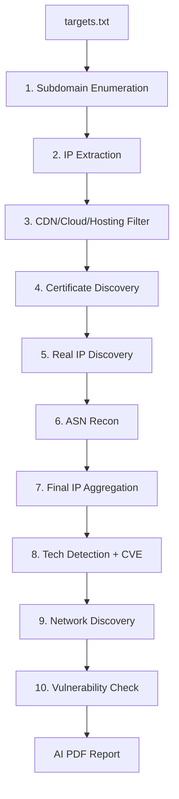

<p align="center">
  
  
  
  
</p>

<h1 align="center">🛡️ RA137 Reconnaissance Framework</h1>

<p align="center">
  <b>An automated, AI-powered reconnaissance and vulnerability assessment pipeline</b><br>
  <sub>Subdomain Enumeration → Origin IP Discovery → Tech Fingerprinting → CVE Analysis → Vulnerability Scanning</sub>
</p>

---

## 📋 Table of Contents

- [Features](#-features)
- [Architecture](#-architecture)
- [Pipeline Overview](#-pipeline-overview)
- [Installation](#-installation)
- [Configuration](#-configuration)
- [Usage](#-usage)
- [Output Structure](#-output-structure)
- [AI Integration](#-ai-integration)
- [Modules Reference](#-modules-reference)
- [Troubleshooting](#-troubleshooting)

---

## ✨ Features

| Feature | Description |
|---------|-------------|
| 🔍 **10-Stage Pipeline** | Fully automated recon from subdomains to vulnerabilities |
| 🤖 **AI-Powered Analysis** | CVE identification, ASN validation, origin-IP confirmation |
| 🛡️ **CDN Bypass** | Detects and filters CDN/Cloud/Hosting IPs (20 providers) |
| 📄 **PDF Reports** | Auto-generated AI analysis reports per target |
| 📱 **Telegram Alerts** | Real-time scan notifications |
| 🔄 **Resumable Scans** | Step-level state tracking — resume where you left off |
| ⚡ **Parallel Targets** | Process multiple targets concurrently |
| 📊 **JSON-First Output** | Structured, machine-readable results from every module |

---

## 🏗️ Architecture

```
┌─────────────────────────────────────────────────────────────┐
│                      RA137 Framework                        │
├─────────────────────────────────────────────────────────────┤
│                                                             │
│  targets.txt                                                │
│      │                                                      │
│      ▼                                                      │
│  ┌──────────┐    ┌──────────┐    ┌──────────┐              │
│  │ 1. Sub   │───▶│ 2. IP    │───▶│ 3. CDN   │              │
│  │  Domain  │    │ Extract  │    │ Filter   │              │
│  │  Enum    │    │ (dnsx +  │    │ (20 CDN/ │              │
│  │(subfinder│    │  httpx)  │    │  Cloud/  │              │
│  │+gobuster)│    │          │    │  Hosting)│              │
│  └──────────┘    └──────────┘    └──────────┘              │
│                                       │                     │
│       ┌───────────────────────────────┘                     │
│       ▼                                                     │
│  ┌──────────┐    ┌──────────┐    ┌──────────┐              │
│  │ 4. Cert  │───▶│ 5. Real  │───▶│ 6. ASN   │              │
│  │ Discovery│    │ IP Find  │    │ Recon    │              │
│  │ (SSL/TLS │    │ (cert +  │    │ (whois + │              │
│  │  cert    │    │  vhost + │    │  bgp +   │              │
│  │  scan)   │    │  body +  │    │  AI val) │              │
│  │          │    │  jarm +  │    │          │              │
│  │          │    │  favicon)│    │          │              │
│  └──────────┘    └──────────┘    └──────────┘              │
│                                       │                     │
│       ┌───────────────────────────────┘                     │
│       ▼                                                     │
│  ┌──────────┐    ┌──────────┐    ┌──────────┐              │
│  │ 7. Final │───▶│ 8. Tech  │───▶│ 9. Net   │              │
│  │ IP Aggr  │    │ Detect + │    │ Discovery│              │
│  │ (merge + │    │ AI CVE   │    │ (nmap +  │              │
│  │  CDN     │    │ Analysis │    │  shodan +│              │
│  │  filter) │    │          │    │  fofa +  │              │
│  │          │    │          │    │  censys) │              │
│  └──────────┘    └──────────┘    └──────────┘              │
│                                       │                     │
│                                       ▼                     │
│                                 ┌──────────┐                │
│                                 │10. Vuln  │                │
│                                 │ Check    │                │
│                                 │(nuclei)  │                │
│                                 └──────────┘                │
│                                       │                     │
│                                       ▼                     │
│                                 ┌──────────┐                │
│                                 │ AI PDF   │                │
│                                 │ Report   │                │
│                                 └──────────┘                │
│                                                             │
└─────────────────────────────────────────────────────────────┘
```

---

## 🔄 Pipeline Overview



| Step | Module | Tool(s) Used | Output File | AI Features |
|------|--------|-------------|-------------|-------------|
| 1 | Subdomain Enum | subfinder, gobuster | `subdomains.json` | — |
| 2 | IP Extraction | dnsx, httpx | `pure_ip.json` | — |
| 3 | CDN Filter | internal CDN DB | `cdn_analysis.json`, `direct_ips.json` | — |
| 4 | Cert Discovery | ssl cert scan | `cert_discovery.json` | — |
| 5 | Real IP Discovery | cert/vhost/body/jarm/favicon | `realip_results.json` | ✅ AI validation |
| 6 | ASN Recon | whois, bgp, ipinfo | `asn_results.json` | ✅ AI validation |
| 7 | Final IP Builder | aggregation + CDN filter | `final_ips.json` | — |
| 8 | Tech Detection | httpx, gowitness | `tech_results.json` | ✅ AI CVE analysis |
| 9 | Network Discovery | nmap, shodan, fofa, censys | `network_results.json` | — |
| 10 | Vuln Check | nuclei | `vuln_results.json` | — |

---

## 🚀 Installation

### Prerequisites

- **Linux** (Ubuntu 20.04+ / Debian 11+)
- **Python 3.10+**
- **Root access** (for installing system tools)

### Quick Install

```bash
# 1. Clone the repository
git clone https://github.com/your-org/RA137.git
cd RA137

# 2. Run the installer (installs all dependencies)
chmod +x install.sh
sudo ./install.sh
```

The installer sets up:

| Category | Tools |
|----------|-------|
| **DNS/Subdomain** | subfinder, dnsx, gobuster |
| **HTTP/Tech** | httpx, gowitness |
| **Vulnerability** | nuclei (+ templates) |
| **Network** | nmap |
| **Fingerprinting** | JARM (Salesforce) |
| **Browser** | Google Chrome (for screenshots) |
| **Python libs** | requests, beautifulsoup4, openai, cryptography, fpdf2, etc. |

### Manual Install (if automated script fails)

```bash
# System packages
sudo apt update
sudo apt install -y python3 python3-pip nmap wget curl unzip git jq

# Python packages
pip3 install requests beautifulsoup4 mmh3 cryptography dnspython \
    urllib3 tldextract openai python-dotenv fpdf2

# ProjectDiscovery tools (download from GitHub releases)
# subfinder:  https://github.com/projectdiscovery/subfinder/releases
# httpx:      https://github.com/projectdiscovery/httpx/releases
# dnsx:       https://github.com/projectdiscovery/dnsx/releases
# nuclei:     https://github.com/projectdiscovery/nuclei/releases

# gobuster:   https://github.com/OJ/gobuster/releases
# gowitness:  https://github.com/sensepost/gowitness/releases

# JARM fingerprinting
git clone https://github.com/salesforce/jarm.git /root/RA137/jarm
pip3 install -r /root/RA137/jarm/requirements.txt

# Update nuclei templates
nuclei -update-templates
```

---

## ⚙️ Configuration

### 1. Create your `.env` file

```bash
cp .env.example .env
nano .env
```

### 2. Configure API Keys

```ini
# ── Required for network intelligence ──
SHODAN_API_KEY=your_shodan_key          # https://shodan.io
FOFA_EMAIL=your_fofa_email              # https://fofa.info
FOFA_API_KEY=your_fofa_key
CENSYS_API_ID=your_censys_id           # https://censys.io
CENSYS_API_SECRET=your_censys_secret
SECURITYTRAILS_API_KEY=your_st_key      # https://securitytrails.com

# ── Free & recommended ──
IPINFO_API_TOKEN=your_ipinfo_token      # https://ipinfo.io (free, unlimited)
```

> 💡 **All API keys are optional.** The tool gracefully skips modules that need missing keys.

### 3. Configure AI (Optional but Recommended)

```ini
# ── Option A: OpenAI ──
AI_PROVIDER=openai
AI_MODEL=gpt-4.1-mini
OPENAI_API_KEY=sk-your-key-here

# ── Option B: Ollama (Local, Free) ──
AI_PROVIDER=ollama
AI_MODEL=llama3
# AI_BASE_URL is auto-detected (http://localhost:11434/v1)

# ── AI Feature Toggles ──
AI_VALIDATION=true    # Enable AI in ASN recon + RealIP + CVE analysis
```

**AI-powered features:**

| Feature | What AI Does |
|---------|-------------|
| **ASN Validation** | Classifies ASN relevance to target, excludes generic cloud/CDN |
| **Real IP Validation** | Confirms origin IPs using signal scoring |
| **CVE Analysis** | Identifies known CVEs for detected technologies |
| **Module Reports** | Generates security analysis per module |
| **PDF Report** | Compiles all AI analyses into a single PDF |

### 4. Configure Telegram Alerts (Optional)

```ini
TELEGRAM_BOT_TOKEN=123456:ABC-DEF...
TELEGRAM_CHAT_ID=-1001234567890
```

### 5. Set Targets

```bash
nano targets.txt
```

```text
example.com
target-site.org
10.0.0.1
```

> One target per line. Domains and IPs are supported.

---

## 📖 Usage

### Basic Scan

```bash
python3 main.py
```

This runs the full 10-step pipeline on all targets in `targets.txt`.

### Parallel Target Processing

```bash
# Process 3 targets simultaneously
PARALLEL_TARGETS=3 python3 main.py
```

### Resume Interrupted Scans

RA137 automatically tracks step completion. If you stop a scan (`Ctrl+C`), simply re-run:

```bash
python3 main.py
```

Completed steps are **skipped automatically**. State is stored in `outputs/.step_state.json`.

### Graceful Shutdown

Press `Ctrl+C` at any time — the current step finishes cleanly before exiting.

---

## 📁 Output Structure

```
outputs/
├── example.com/
│   ├── subdomains.json          # Discovered subdomains
│   ├── pure_ip.json             # Resolved IPs
│   ├── cdn_analysis.json        # CDN/Cloud/Hosting classification
│   ├── direct_ips.json          # Non-CDN IPs
│   ├── cert_discovery.json      # SSL certificate findings
│   ├── realip_results.json      # Origin IP candidates + scores
│   ├── asn_results.json         # ASN recon data
│   ├── final_ips.json           # ✅ Aggregated, CDN-filtered IPs
│   ├── tech_results.json        # Technologies + CVE analysis
│   ├── network_results.json     # Nmap, Shodan, FOFA, Censys data
│   ├── vuln_results.json        # Nuclei vulnerability findings
│   ├── ai_report.pdf            # 📄 AI-generated security report
│   ├── screenshots/             # 📸 gowitness screenshots
│   └── logs/
│       └── target.log           # Per-target log file
├── .step_state.json             # Scan resume state
└── recon.log                    # Global log
```

### Key Output Files

<details>
<summary><b>📄 final_ips.json</b> — The main IP list for scanning</summary>

```json
{
  "metadata": {
    "module": "Final IP Aggregation",
    "target": "example.com",
    "scan_time": "2026-06-20T17:07:31"
  },
  "total_ips": 42,
  "total_cidr_ranges": 2,
  "source_counts": {
    "cdn_direct": 3,
    "realip_discovery": 2,
    "asn_recon": 15,
    "cert_discovery": 8,
    "pure_ip": 4
  },
  "ips": ["1.2.3.4", "5.6.7.8", "..."],
  "cidr_ranges": ["1.2.3.0/24", "5.6.7.0/24"]
}
```

> ⚠️ **CDN IPs are automatically filtered out** from this file. Only origin/infrastructure IPs are included.

</details>

<details>
<summary><b>📄 tech_results.json</b> — Technologies + CVEs</summary>

```json
{
  "metadata": { ... },
  "total_results": 284,
  "results": [ ... ],
  "unique_technologies": [
    "Apache HTTP Server:2.4.58",
    "Nginx:1.18.0",
    "IIS:10.0",
    "PHP",
    "Microsoft ASP.NET"
  ],
  "cve_analysis": [
    {
      "technology": "nginx 1.18.0",
      "cve_id": "CVE-2021-23017",
      "severity": "high",
      "description": "Off-by-one error in ngx_resolver",
      "affected_versions": "< 1.20.1"
    }
  ],
  "total_cves": 5
}
```

</details>

---

## 🤖 AI Integration

RA137 integrates AI at **4 key points** in the pipeline:

```
┌──────────────────────────────────────────────────────┐
│                  AI Integration Points                │
├──────────────────────────────────────────────────────┤
│                                                      │
│  Step 5: Real IP Discovery                           │
│  ┌────────────────────────────────────────────┐      │
│  │ AI confirms origin IPs using signal scores │      │
│  │ (cert, vhost, body, jarm, favicon match)   │      │
│  │ → Reduces false positives                  │      │
│  └────────────────────────────────────────────┘      │
│                                                      │
│  Step 6: ASN Recon                                   │
│  ┌────────────────────────────────────────────┐      │
│  │ AI classifies ASN relevance to target      │      │
│  │ → Catches ASNs that heuristics miss        │      │
│  └────────────────────────────────────────────┘      │
│                                                      │
│  Step 8: Tech Detection                              │
│  ┌────────────────────────────────────────────┐      │
│  │ AI identifies known CVEs for detected      │      │
│  │ technologies with version numbers          │      │
│  │ → Returns CVE IDs, severity, descriptions  │      │
│  └────────────────────────────────────────────┘      │
│                                                      │
│  All Steps: AI Reports                               │
│  ┌────────────────────────────────────────────┐      │
│  │ Each module sends data to AI for security  │      │
│  │ analysis → compiled into ai_report.pdf     │      │
│  └────────────────────────────────────────────┘      │
│                                                      │
└──────────────────────────────────────────────────────┘
```

### AI Provider Setup

**Using OpenAI (cloud):**
```ini
AI_PROVIDER=openai
AI_MODEL=gpt-4.1-mini        # Cost-effective, fast
OPENAI_API_KEY=sk-xxxxx
```

**Using Ollama (local, free, offline):**
```bash
# Install Ollama
curl -fsSL https://ollama.com/install.sh | sh

# Pull a model
ollama pull llama3

# Configure RA137
```
```ini
AI_PROVIDER=ollama
AI_MODEL=llama3
```

### Disable AI Features

```ini
AI_VALIDATION=false
```

When disabled:
- ASN recon uses heuristic filtering only
- Real IP discovery uses signal scoring only
- Tech detection skips CVE analysis
- AI reports are not generated (no PDF)

---

## 📚 Modules Reference

### 1. Subdomain Enumeration
- **Tools:** subfinder (passive) + gobuster (brute-force DNS)
- **Wordlist:** `wordlists/subdomains.txt`
- **Output:** `subdomains.json`

### 2. IP Extraction
- **Tools:** dnsx (DNS resolution) + httpx (HTTP probing)
- **Output:** `pure_ip.json`

### 3. CDN / Cloud / Hosting Detection
- **Database:** 20 providers (Cloudflare, AWS, GCP, Azure, Akamai, ArvanCloud, Hetzner, OVH, ...)
- **Output:** `cdn_analysis.json`, `direct_ips.json`
- **Auto-updates** CDN ranges from official provider sources

### 4. Certificate Discovery
- Scans IP ranges for SSL/TLS certificates
- Extracts CN, SAN entries to discover hidden domains
- **Output:** `cert_discovery.json`

### 5. Real IP Discovery
- Multi-signal origin IP detection behind CDNs:
  - Certificate CN/SAN matching (weight: 5)
  - Virtual host matching (weight: 4)
  - HTTP body similarity (weight: 3)
  - JARM TLS fingerprint (weight: 2)
  - Favicon hash matching (weight: 1)
- **AI validates** candidates to reduce false positives
- **Output:** `realip_results.json`

### 6. ASN Recon
- WHOIS, BGP, and IPinfo-based ASN discovery
- Organization name filtering
- **AI validates** ASN relevance to target
- **Output:** `asn_results.json`

### 7. Final IP Aggregation
- Merges IPs from ALL discovery modules
- **Triple CDN/Cloud/Hosting filter:**
  - Pre-expansion IP filter
  - CIDR range filter (checks network + broadcast addresses)
  - Post-expansion IP filter
- Generates /24 ranges when no ASN data available
- **Output:** `final_ips.json`

### 8. Technology Detection
- httpx tech fingerprinting (web servers, frameworks, WAFs)
- gowitness screenshots of discovered URLs
- **AI CVE analysis** — identifies known vulnerabilities
- **Output:** `tech_results.json`

### 9. Network Discovery
- **Nmap** — port/service scanning
- **Shodan** — internet-wide scan data
- **FOFA** — Chinese internet search engine
- **Censys** — internet-wide certificate/service data
- **SecurityTrails** — historical DNS data
- **Output:** `network_results.json`

### 10. Vulnerability Check
- nuclei automated vulnerability scanning
- Templates auto-updated on install
- **Output:** `vuln_results.json`

---

## 🔧 Troubleshooting

### Common Issues

| Issue | Solution |
|-------|----------|
| `subfinder: command not found` | Re-run `sudo ./install.sh` or install manually |
| `ModuleNotFoundError: openai` | `pip3 install openai` |
| CDN ranges outdated | Delete `wordlists/all_cdn.txt` — it auto-downloads on next run |
| AI reports empty | Check `OPENAI_API_KEY` or Ollama is running (`ollama serve`) |
| Nuclei finds nothing | Run `nuclei -update-templates` first |
| Scan stuck on a step | Check `outputs/<target>/logs/target.log` for errors |
| Want to rescan from scratch | Delete the target's output folder and `.step_state.json` |

### Log Files

```bash
# Global log
cat outputs/recon.log

# Per-target log
cat outputs/example.com/logs/target.log
```

### Reset Scan State

```bash
# Reset all cached state (forces full rescan)
rm outputs/.step_state.json

# Reset state for one target
# Edit .step_state.json and remove the target's entry
```

---

## 📊 Environment Variables Reference

| Variable | Default | Description |
|----------|---------|-------------|
| `PARALLEL_TARGETS` | `1` | Number of targets to process simultaneously |
| `MAX_WORKERS` | `50` | General concurrency limit |
| `MAX_CDN_WORKERS` | `20` | CDN range download threads |
| `MAX_CERT_WORKERS` | `100` | Certificate scan concurrency |
| `HTTP_TIMEOUT` | `30` | HTTP request timeout (seconds) |
| `COMMAND_TIMEOUT` | `10000` | External command timeout (seconds) |
| `NMAP_TIMEOUT` | `600` | Nmap scan timeout (seconds) |
| `OUTPUT_BASE` | `outputs` | Base output directory |
| `TARGETS_FILE` | `targets.txt` | Path to targets file |
| `AI_PROVIDER` | `openai` | AI provider (`openai` or `ollama`) |
| `AI_MODEL` | `gpt-4.1-mini` | AI model name |
| `AI_VALIDATION` | `true` | Enable AI validation features |

---

## 📜 License

This project is provided for **educational and authorized security testing** purposes only. Always obtain proper authorization before scanning targets.
